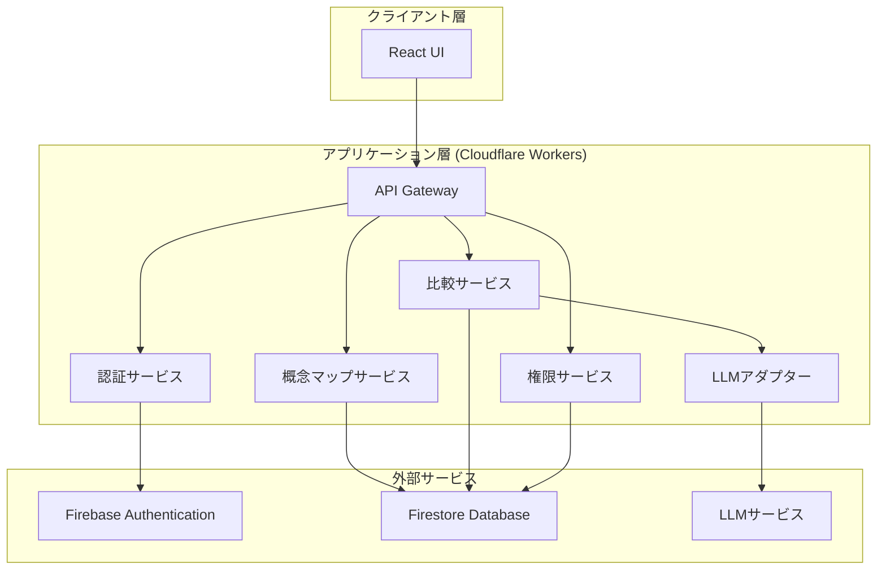

# 設計書

## 概要

Peer Resonant Concept Mappingシステムは、教育現場における概念マップの作成と比較を支援するWebアプリケーションです。学生は自由に概念マップを作成し、教師は学生の理解度を評価するために複数の概念マップを比較できます。システムの核心的な機能は、LLMを活用した語彙調整により、異なる表現でも意味的に類似した概念を識別し、有意義な比較を可能にすることです。

### 技術スタック

- **フロントエンド**: React + TypeScript
- **バックエンド**: Cloudflare Workers (サーバーレス)
- **データベース**: Firebase Firestore (peer-resonant-concept-map2)
- **認証**: Firebase Authentication
- **LLMサービス**: LM Studio (http://127.0.0.1:1234) - openai/gpt-oss-20b
- **デプロイ**: Cloudflare Pages (フロントエンド) + Cloudflare Workers (API)
- **ソース管理**: GitHub (yusuke-hayashi/PeerResonantConceptMapping2)

### アーキテクチャの注意点

- **LLMサービスのアクセス**: LM StudioはローカルホストでLLMサービスはCloudflare Workersから直接アクセスできません。以下の2つのアプローチが考えられます：
  1. **開発環境**: ローカル開発時はフロントエンドから直接LM Studioにアクセス
  2. **本番環境**: 公開されたLLM APIエンドポイントを使用、またはCloudflare Workersと同じネットワークにLLMサービスをデプロイ
  
  本設計では、開発時はローカルのLM Studio (http://127.0.0.1:1234)を使用し、本番環境では設定可能なLLMエンドポイントを使用する柔軟な設計とします。

## アーキテクチャ

システムは3層アーキテクチャを採用します：

1. **プレゼンテーション層**: Reactベースのシングルページアプリケーション
2. **アプリケーション層**: Cloudflare Workersで実行されるビジネスロジック
3. **データ層**: Firebase Firestoreによる永続化



### アーキテクチャの設計判断

1. **サーバーレスアーキテクチャ**: Cloudflare Workersを使用することで、スケーラビリティとコスト効率を実現
2. **Firebase統合**: 認証とデータベースをFirebaseで統一し、開発効率を向上
3. **LLMアダプターパターン**: 複数のLLMサービスに対応できる抽象化層を設ける

## UI/UX設計

### ノードの視覚的表現

概念マップのノードは、タイプに応じて異なる視覚的スタイルを持ちます：

#### 名詞ノード
- **形状**: 角が角張った長方形（rectangle）
- **色**: 寒色系から選択
  - 青系: #3B82F6, #2563EB, #1D4ED8, #1E40AF, #1E3A8A
  - 緑系: #10B981, #059669, #047857
  - 紫系: #8B5CF6, #7C3AED, #6D28D9
- **角の丸み**: なし（borderRadius: 0）

#### 動詞ノード
- **形状**: 角が丸い長方形（rounded-rectangle）
- **色**: 暖色系から選択
  - 赤系: #EF4444, #DC2626, #B91C1C
  - オレンジ系: #F97316, #EA580C, #C2410C
  - 黄系: #F59E0B, #D97706, #B45309
- **角の丸み**: 12px（borderRadius: 12）

#### リンクの視覚的表現
- **線のスタイル**: 実線の矢印
- **色**: グレー系（#6B7280）
- **太さ**: 2px
- **ラベル**: リンクの中央に関係性のテキストを表示

### インタラクション設計

1. **ノードの作成**
   - キャンバス上でダブルクリック→ノードタイプ選択ダイアログ→ラベル入力
   - 色は選択されたタイプに応じた色パレットから選択可能

2. **リンクの作成**
   - ノードをドラッグして別のノードにドロップ→関係性入力ダイアログ

3. **ノードの移動**
   - ドラッグ&ドロップで自由に配置

4. **編集・削除**
   - ノードまたはリンクをクリック→コンテキストメニュー表示

## コンポーネントとインターフェース

### 1. 認証サービス (AuthService)

ユーザー認証と役割管理を担当します。

```typescript
interface AuthService {
  // ユーザー認証
  signIn(email: string, password: string): Promise<AuthResult>;
  signOut(): Promise<void>;
  
  // 役割判定
  getUserRole(userId: string): Promise<UserRole>;
  
  // セッション管理
  validateSession(token: string): Promise<SessionInfo>;
}

interface AuthResult {
  userId: string;
  token: string;
  role: UserRole;
}

enum UserRole {
  TEACHER = 'teacher',
  STUDENT = 'student'
}

interface SessionInfo {
  userId: string;
  role: UserRole;
  expiresAt: Date;
}
```

### 2. 概念マップサービス (ConceptMapService)

概念マップのCRUD操作を提供します。

```typescript
interface ConceptMapService {
  // 作成
  createMap(userId: string, topicId: string, isReference: boolean): Promise<ConceptMap>;
  
  // 読み取り
  getMap(mapId: string, userId: string): Promise<ConceptMap>;
  getMapsByTopic(topicId: string, userId: string, role: UserRole): Promise<ConceptMap[]>;
  getMapsByUser(userId: string): Promise<ConceptMap[]>;
  
  // 更新
  updateMap(mapId: string, userId: string, updates: MapUpdates): Promise<ConceptMap>;
  addNode(mapId: string, userId: string, node: Node): Promise<ConceptMap>;
  addLink(mapId: string, userId: string, link: Link): Promise<ConceptMap>;
  removeNode(mapId: string, userId: string, nodeId: string): Promise<ConceptMap>;
  removeLink(mapId: string, userId: string, linkId: string): Promise<ConceptMap>;
  
  // 削除
  deleteMap(mapId: string, userId: string): Promise<void>;
  
  // 権限チェック
  canEdit(mapId: string, userId: string): Promise<boolean>;
  canView(mapId: string, userId: string): Promise<boolean>;
}
```

### 3. 比較サービス (ComparisonService)

概念マップの比較と語彙調整を担当します。

```typescript
interface ComparisonService {
  // 比較の作成
  createOneToOneComparison(
    teacherMapId: string,
    studentMapId: string,
    teacherId: string
  ): Promise<Comparison>;
  
  createTeacherToAllComparison(
    teacherMapId: string,
    topicId: string,
    teacherId: string
  ): Promise<Comparison[]>;
  
  createAllStudentsComparison(
    topicId: string,
    teacherId: string
  ): Promise<Comparison[]>;
  
  createPartialStudentsComparison(
    studentMapIds: string[],
    teacherId: string
  ): Promise<Comparison[]>;
  
  // 比較の取得
  getComparison(comparisonId: string, userId: string): Promise<Comparison>;
  getAccessibleComparisons(userId: string, role: UserRole): Promise<Comparison[]>;
  
  // 語彙調整
  adjustVocabulary(maps: ConceptMap[]): Promise<AdjustedConceptMap[]>;
}
```

### 4. 権限サービス (PermissionService)

比較結果の閲覧権限を管理します。

```typescript
interface PermissionService {
  // 権限の付与
  grantViewPermission(
    comparisonId: string,
    studentIds: string[],
    teacherId: string
  ): Promise<void>;
  
  // 権限の取り消し
  revokeViewPermission(
    comparisonId: string,
    studentIds: string[],
    teacherId: string
  ): Promise<void>;
  
  // 権限の確認
  canViewComparison(comparisonId: string, userId: string): Promise<boolean>;
  
  // 権限の取得
  getPermissions(comparisonId: string): Promise<Permission[]>;
}

interface Permission {
  comparisonId: string;
  studentId: string;
  grantedAt: Date;
  grantedBy: string;
}
```

### 5. LLMアダプター (LLMAdapter)

複数のLLMサービスに対応する抽象化層です。

```typescript
interface LLMAdapter {
  // 語彙調整
  adjustTerms(terms: string[], context: string): Promise<AdjustedTerms>;
  
  // 設定
  configure(config: LLMConfig): void;
}

interface LLMConfig {
  provider: 'lm-studio' | 'openai-compatible';
  endpoint: string; // デフォルト: http://127.0.0.1:1234
  apiKey?: string; // 必要に応じて
  model: string; // デフォルト: openai/gpt-oss-20b
}

interface AdjustedTerms {
  original: string[];
  adjusted: string[];
  mappings: TermMapping[];
}

interface TermMapping {
  original: string;
  adjusted: string;
  confidence: number;
}
```

## データモデル

### 1. User (ユーザー)

```typescript
interface User {
  id: string;
  email: string;
  role: UserRole;
  displayName: string;
  createdAt: Date;
  updatedAt: Date;
}
```

Firestoreコレクション: `users`

### 2. Topic (トピック)

```typescript
interface Topic {
  id: string;
  name: string;
  description: string;
  createdBy: string; // 教師のユーザーID
  createdAt: Date;
  updatedAt: Date;
}
```

Firestoreコレクション: `topics`

インデックス:
- `createdBy` (昇順)
- `createdAt` (降順)

### 3. ConceptMap (概念マップ)

```typescript
interface ConceptMap {
  id: string;
  topicId: string;
  ownerId: string;
  isReference: boolean; // 教師の見本マップかどうか
  nodes: Node[];
  links: Link[];
  createdAt: Date;
  updatedAt: Date;
}

interface Node {
  id: string;
  label: string;
  type: 'noun' | 'verb';
  position: Position;
  style: NodeStyle;
  metadata?: Record<string, any>;
}

interface NodeStyle {
  shape: 'rectangle' | 'rounded-rectangle'; // noun: rectangle, verb: rounded-rectangle
  color: string; // noun: 寒色系, verb: 暖色系
  borderRadius?: number; // 角の丸み（動詞用）
}

// ノードスタイルのデフォルト設定
const NODE_STYLE_PRESETS = {
  noun: {
    shape: 'rectangle' as const,
    colors: ['#3B82F6', '#2563EB', '#1D4ED8', '#1E40AF', '#1E3A8A'], // 青系（寒色）
    borderRadius: 0
  },
  verb: {
    shape: 'rounded-rectangle' as const,
    colors: ['#EF4444', '#DC2626', '#B91C1C', '#F97316', '#EA580C'], // 赤・オレンジ系（暖色）
    borderRadius: 12
  }
};

interface Link {
  id: string;
  sourceNodeId: string;
  targetNodeId: string;
  relationship: string;
  metadata?: Record<string, any>;
}

interface Position {
  x: number;
  y: number;
}
```

Firestoreコレクション: `concept_maps`

インデックス:
- `topicId` (昇順), `ownerId` (昇順)
- `topicId` (昇順), `isReference` (昇順)
- `ownerId` (昇順), `createdAt` (降順)

### 4. Comparison (比較)

```typescript
interface Comparison {
  id: string;
  type: ComparisonType;
  topicId: string;
  mapIds: string[]; // 比較対象の概念マップID
  createdBy: string; // 教師のユーザーID
  result: ComparisonResult;
  createdAt: Date;
}

enum ComparisonType {
  ONE_TO_ONE = 'one_to_one',
  TEACHER_TO_ALL = 'teacher_to_all',
  ALL_STUDENTS = 'all_students',
  PARTIAL_STUDENTS = 'partial_students'
}

interface ComparisonResult {
  adjustedMaps: AdjustedConceptMap[];
  similarities: Similarity[];
  differences: Difference[];
}

interface AdjustedConceptMap {
  originalMapId: string;
  adjustedNodes: AdjustedNode[];
  adjustedLinks: AdjustedLink[];
}

interface AdjustedNode {
  originalId: string;
  originalLabel: string;
  adjustedLabel: string;
  type: 'noun' | 'verb';
  position: Position;
}

interface AdjustedLink {
  originalId: string;
  sourceNodeId: string;
  targetNodeId: string;
  originalRelationship: string;
  adjustedRelationship: string;
}

interface Similarity {
  mapId1: string;
  mapId2: string;
  matchingNodes: NodeMatch[];
  matchingLinks: LinkMatch[];
  similarityScore: number;
}

interface NodeMatch {
  nodeId1: string;
  nodeId2: string;
  adjustedLabel: string;
  confidence: number;
}

interface LinkMatch {
  linkId1: string;
  linkId2: string;
  adjustedRelationship: string;
  confidence: number;
}

interface Difference {
  mapId: string;
  uniqueNodes: string[]; // 他のマップにない固有のノードID
  uniqueLinks: string[]; // 他のマップにない固有のリンクID
}
```

Firestoreコレクション: `comparisons`

インデックス:
- `topicId` (昇順), `createdBy` (昇順)
- `createdBy` (昇順), `createdAt` (降順)

### 5. ComparisonPermission (比較権限)

```typescript
interface ComparisonPermission {
  id: string;
  comparisonId: string;
  studentId: string;
  grantedBy: string; // 教師のユーザーID
  grantedAt: Date;
}
```

Firestoreコレクション: `comparison_permissions`

インデックス:
- `comparisonId` (昇順), `studentId` (昇順)
- `studentId` (昇順), `grantedAt` (降順)


## 正しさのプロパティ

*プロパティとは、システムのすべての有効な実行において真であるべき特性または動作です。本質的には、システムが何をすべきかについての形式的な記述です。プロパティは、人間が読める仕様と機械で検証可能な正しさの保証との橋渡しとなります。*

### プロパティ1: 概念マップの永続化ラウンドトリップ

*任意の*概念マップについて、保存してから取得した場合、すべてのノード、リンク、メタデータを含む元のマップと同等のマップが返される

**検証対象: 要件 1.4, 1.5**

### プロパティ2: ノードタイプの検証

*任意の*ノード追加操作について、ノードのタイプが'noun'または'verb'でない場合、システムは操作を拒否する

**検証対象: 要件 1.2**

### プロパティ3: リンクの関係性保存

*任意の*リンク作成操作について、作成されたリンクには関係性の説明が含まれ、取得時に同じ説明が返される

**検証対象: 要件 1.3**

### プロパティ4: トピック関連付けの必須性

*任意の*概念マップ作成について、マップは必ず有効なトピックIDに関連付けられ、トピックIDなしでの作成は拒否される

**検証対象: 要件 1.1, 9.1**

### プロパティ5: 見本マップのマーキング

*任意の*教師が作成した概念マップについて、見本マップとして作成された場合、isReferenceフラグがtrueに設定される

**検証対象: 要件 2.1**

### プロパティ6: 比較結果の不変性

*任意の*既存の比較について、元の見本マップを編集しても、既存の比較結果は変更されない

**検証対象: 要件 2.3**

### プロパティ7: 比較モードの正確性

*任意の*比較操作について、比較に含まれる概念マップの数と種類は選択されたモードに一致する：
- 1対1モード: 正確に2つのマップ（見本1つ + 学生1つ）
- 教師対全学生モード: N+1個のマップ（見本1つ + トピック内の全学生マップN個）
- 学生全体モード: N個のマップ（トピック内の全学生マップ）
- 一部学生モード: M個のマップ（選択された学生マップ）

**検証対象: 要件 3.1, 3.2, 3.3, 3.4**

### プロパティ8: 語彙調整の必須実行

*任意の*比較操作について、比較結果を生成する前にLLMサービスが呼び出され、語彙調整が実行される

**検証対象: 要件 3.5**

### プロパティ9: 比較のデフォルト非公開性

*任意の*新規作成された比較について、学生への閲覧権限が明示的に付与されるまで、デフォルトで非公開である

**検証対象: 要件 4.1**

### プロパティ10: 権限のラウンドトリップ

*任意の*比較と学生について、閲覧権限を付与すると学生はアクセス可能になり、権限を取り消すとアクセスできなくなる

**検証対象: 要件 4.2, 4.3, 4.4, 6.1, 6.3**

### プロパティ11: 所有者ベースのアクセス制御

*任意の*学生について、その学生が閲覧・編集できる概念マップは、自分が所有するマップまたは許可された比較を通じてアクセス可能なマップのみである

**検証対象: 要件 5.1, 5.2, 5.3, 5.4**

### プロパティ12: 比較結果の構造完全性

*任意の*許可された比較について、学生が閲覧する際、比較結果には語彙調整された概念マップ（adjustedMaps）が含まれる

**検証対象: 要件 6.2, 6.4**

### プロパティ13: 語彙調整の非破壊性

*任意の*概念マップについて、語彙調整を実行しても、Firestoreに保存された元のノードラベルとリンクの関係性は変更されない

**検証対象: 要件 7.4**

### プロパティ14: 役割ベースの機能アクセス

*任意の*認証されたユーザーについて、そのユーザーの役割（教師または学生）に応じて、アクセス可能な機能が制限される：
- 教師: 比較作成、権限管理、すべての学生マップの閲覧
- 学生: 自分のマップの作成・編集、許可された比較の閲覧

**検証対象: 要件 8.2, 8.3, 8.4**

### プロパティ15: セッション期限切れ時の再認証

*任意の*期限切れセッショントークンについて、そのトークンを使用したAPI呼び出しは拒否され、再認証が要求される

**検証対象: 要件 8.5**

### プロパティ16: トピック境界の尊重

*任意の*比較操作について、比較に含まれるすべての概念マップは同じトピックIDを持つ

**検証対象: 要件 9.2**

### プロパティ17: トピック別の整理

*任意の*学生の概念マップリストについて、マップはトピックIDでグループ化されて返される

**検証対象: 要件 9.3**

## エラーハンドリング

### 1. 認証エラー

- **無効な認証情報**: 401 Unauthorizedを返し、エラーメッセージを提供
- **セッション期限切れ**: 401 Unauthorizedを返し、再ログインを促す
- **権限不足**: 403 Forbiddenを返し、必要な権限を説明

### 2. バリデーションエラー

- **無効なノードタイプ**: 400 Bad Requestを返し、許可されるタイプ（noun, verb）を説明
- **トピックID未指定**: 400 Bad Requestを返し、トピック指定が必須であることを説明
- **存在しないリソース**: 404 Not Foundを返し、リソースが見つからないことを説明

### 3. LLMサービスエラー

- **LLM接続失敗**: 比較操作を中断し、503 Service Unavailableを返す。ユーザーに「語彙調整サービスが一時的に利用できません」と通知
- **LLMタイムアウト**: 30秒のタイムアウト後、比較操作を中断し、ユーザーに再試行を促す
- **LLM応答エラー**: エラーをログに記録し、フォールバック動作として元の語彙で比較を実行（調整なし）

### 4. データベースエラー

- **Firestore接続失敗**: 500 Internal Server Errorを返し、「データベース接続エラー」を通知
- **書き込み失敗**: トランザクションをロールバックし、ユーザーに操作失敗を通知
- **読み取り失敗**: 500 Internal Server Errorを返し、再試行を促す

### 5. 権限エラー

- **所有者でないマップの編集**: 403 Forbiddenを返し、「このマップを編集する権限がありません」と通知
- **許可されていない比較の閲覧**: 403 Forbiddenを返し、「この比較を閲覧する権限がありません」と通知

### エラーレスポンス形式

すべてのエラーレスポンスは以下の形式に従います：

```typescript
interface ErrorResponse {
  error: {
    code: string;
    message: string;
    details?: Record<string, any>;
  };
}
```

例：
```json
{
  "error": {
    "code": "INVALID_NODE_TYPE",
    "message": "ノードタイプは'noun'または'verb'である必要があります",
    "details": {
      "providedType": "adjective",
      "allowedTypes": ["noun", "verb"]
    }
  }
}
```

## テスト戦略

### 単体テスト

単体テストは、個々のコンポーネントとサービスの具体的な動作を検証します：

1. **サービス層のテスト**
   - 各サービスメソッドの正常系と異常系
   - モックを使用した外部依存関係の分離
   - エッジケース（空のマップ、存在しないID等）

2. **バリデーションロジックのテスト**
   - ノードタイプの検証
   - トピックIDの必須チェック
   - 権限チェックロジック

3. **データ変換のテスト**
   - 概念マップのシリアライゼーション/デシリアライゼーション
   - LLM応答のパース
   - 比較結果の生成

### プロパティベーステスト

プロパティベーステストは、すべての入力に対して成立すべき普遍的なプロパティを検証します。

**使用ライブラリ**: fast-check (TypeScript/JavaScript用のプロパティベーステストライブラリ)

**設定**: 各プロパティテストは最低100回の反復を実行

**テストの実装要件**:
- 各プロパティテストは、設計書の正しさのプロパティを明示的に参照するコメントを含める
- コメント形式: `// Feature: peer-concept-mapping, Property {番号}: {プロパティテキスト}`
- 各正しさのプロパティは、単一のプロパティベーステストで実装される

**テスト対象のプロパティ**:

1. **プロパティ1: 概念マップの永続化ラウンドトリップ**
   - ランダムな概念マップを生成
   - 保存して取得
   - 元のマップと同等であることを検証

2. **プロパティ2: ノードタイプの検証**
   - ランダムな文字列をノードタイプとして生成
   - 'noun'と'verb'のみが受け入れられることを検証

3. **プロパティ3: リンクの関係性保存**
   - ランダムなリンクを生成
   - 関係性の説明が保存・取得されることを検証

4. **プロパティ4: トピック関連付けの必須性**
   - トピックIDありとなしで概念マップ作成を試行
   - トピックIDなしは拒否されることを検証

5. **プロパティ5: 見本マップのマーキング**
   - ランダムな教師マップを生成
   - isReferenceフラグが正しく設定されることを検証

6. **プロパティ6: 比較結果の不変性**
   - 比較を作成し、元のマップを編集
   - 比較結果が変更されないことを検証

7. **プロパティ7: 比較モードの正確性**
   - 各比較モードでランダムなマップセットを生成
   - 比較に含まれるマップ数が正しいことを検証

8. **プロパティ8: 語彙調整の必須実行**
   - LLMサービスをモック
   - すべての比較でLLMが呼び出されることを検証

9. **プロパティ9: 比較のデフォルト非公開性**
   - ランダムな比較を作成
   - デフォルトで権限が設定されていないことを検証

10. **プロパティ10: 権限のラウンドトリップ**
    - 権限を付与→アクセス可能、取り消し→アクセス不可を検証

11. **プロパティ11: 所有者ベースのアクセス制御**
    - ランダムな学生とマップを生成
    - 所有者のみがアクセスできることを検証

12. **プロパティ12: 比較結果の構造完全性**
    - ランダムな比較を生成
    - adjustedMapsが含まれることを検証

13. **プロパティ13: 語彙調整の非破壊性**
    - 語彙調整を実行
    - 元のデータが変更されていないことを検証

14. **プロパティ14: 役割ベースの機能アクセス**
    - 教師と学生の役割でランダムな操作を試行
    - 役割に応じたアクセス制御を検証

15. **プロパティ15: セッション期限切れ時の再認証**
    - 期限切れトークンでランダムなAPI呼び出し
    - すべて拒否されることを検証

16. **プロパティ16: トピック境界の尊重**
    - ランダムな比較を生成
    - すべてのマップが同じトピックであることを検証

17. **プロパティ17: トピック別の整理**
    - ランダムなマップリストを生成
    - トピックでグループ化されることを検証

### 統合テスト

統合テストは、複数のコンポーネントが連携して動作することを検証します：

1. **認証フロー**
   - Firebase Authenticationとの統合
   - ログイン→役割判定→機能アクセスの一連の流れ

2. **概念マップのCRUDフロー**
   - 作成→保存→取得→編集→削除の一連の操作
   - Firestoreとの実際の連携

3. **比較生成フロー**
   - マップ選択→LLM呼び出し→語彙調整→比較結果生成
   - 実際のLLMサービスとの連携（またはモック）

4. **権限管理フロー**
   - 比較作成→権限付与→学生アクセス→権限取り消し

### エンドツーエンドテスト

主要なユーザーシナリオを検証します：

1. **学生の概念マップ作成シナリオ**
   - ログイン→トピック選択→マップ作成→ノード追加→リンク作成→保存

2. **教師の比較作成シナリオ**
   - ログイン→トピック選択→比較モード選択→マップ選択→比較生成→権限付与

3. **学生の比較閲覧シナリオ**
   - ログイン→許可された比較リスト表示→比較選択→語彙調整済みマップ閲覧

### テストデータ生成

プロパティベーステストのために、以下のジェネレーターを実装します：

```typescript
// fast-checkを使用したジェネレーター例

// 概念マップジェネレーター
const conceptMapArbitrary = fc.record({
  id: fc.uuid(),
  topicId: fc.uuid(),
  ownerId: fc.uuid(),
  isReference: fc.boolean(),
  nodes: fc.array(nodeArbitrary, { minLength: 1, maxLength: 20 }),
  links: fc.array(linkArbitrary, { minLength: 0, maxLength: 30 }),
  createdAt: fc.date(),
  updatedAt: fc.date()
});

// ノードジェネレーター
const nodeArbitrary = fc.record({
  id: fc.uuid(),
  label: fc.string({ minLength: 1, maxLength: 50 }),
  type: fc.constantFrom('noun', 'verb'),
  position: fc.record({
    x: fc.integer({ min: 0, max: 1000 }),
    y: fc.integer({ min: 0, max: 1000 })
  })
});

// リンクジェネレーター
const linkArbitrary = fc.record({
  id: fc.uuid(),
  sourceNodeId: fc.uuid(),
  targetNodeId: fc.uuid(),
  relationship: fc.string({ minLength: 1, maxLength: 100 })
});
```

### テスト環境

- **開発環境**: Firebase Emulator Suiteを使用してローカルでテスト
- **CI/CD**: GitHub Actionsでプルリクエスト毎に自動テスト実行
- **ステージング環境**: 本番に近い環境で統合テストとE2Eテストを実行

## フロントエンド設計（Task 12-18）

### ディレクトリ構造

```
frontend/src/
├── components/
│   ├── Layout.tsx          # メインレイアウト
│   ├── Header.tsx          # ヘッダー（ユーザー情報、ログアウト）
│   ├── Navigation.tsx      # ロール別ナビゲーション
│   └── ProtectedRoute.tsx  # 認証保護ルート
├── pages/
│   ├── LoginPage.tsx       # ログインページ
│   ├── DashboardPage.tsx   # ダッシュボード
│   └── NotFoundPage.tsx    # 404ページ
├── contexts/
│   └── AuthContext.tsx     # 認証コンテキスト（実装済み）
├── config/
│   └── firebase.ts         # Firebase設定（実装済み）
└── App.tsx                 # ルーティング統合
```

### Task 12: フロントエンド基本構造

#### 実装済み
- `src/config/firebase.ts` - Firebase初期化
- `src/contexts/AuthContext.tsx` - 認証コンテキスト（signIn, signOut, useAuth）

#### 新規実装

1. **ProtectedRoute** (`src/components/ProtectedRoute.tsx`)
   - 認証チェック
   - 未認証時は`/login`へリダイレクト
   - ローディング状態の表示

2. **Header** (`src/components/Header.tsx`)
   - アプリ名表示
   - ユーザー情報（displayName、role）
   - ログアウトボタン

3. **Navigation** (`src/components/Navigation.tsx`)
   - ロール別メニュー表示
     - 共通: ダッシュボード、マイマップ
     - 教師のみ: トピック管理、比較機能

4. **Layout** (`src/components/Layout.tsx`)
   - Header + Navigation + Outlet（子ルート）

5. **LoginPage** (`src/pages/LoginPage.tsx`)
   - メール/パスワード入力フォーム
   - useAuth().signIn()呼び出し

6. **DashboardPage** (`src/pages/DashboardPage.tsx`)
   - ロール別のウェルカムメッセージ

7. **NotFoundPage** (`src/pages/NotFoundPage.tsx`)
   - 404エラー表示

8. **App.tsx**（更新）
   ```tsx
   <AuthProvider>
     <BrowserRouter>
       <Routes>
         <Route path="/login" element={<LoginPage />} />
         <Route element={<ProtectedRoute />}>
           <Route element={<Layout />}>
             <Route path="/" element={<DashboardPage />} />
             <Route path="/maps" element={<Placeholder />} />
             <Route path="/topics" element={<Placeholder />} />
             <Route path="/comparisons" element={<Placeholder />} />
           </Route>
         </Route>
         <Route path="*" element={<NotFoundPage />} />
       </Routes>
     </BrowserRouter>
   </AuthProvider>
   ```

### Cloudflare Workers と Firebase の接続

#### 現在の構成
- **フロントエンド**: Firebase SDK直接使用（Authentication、Firestore）
- **バックエンド (Workers)**: モック実装（本番ではFirebase Admin SDK必要）

#### 本番環境での接続方法

1. **Firebase Admin SDK for Workers**
   - Cloudflare WorkersではNode.js APIが制限されているため、firebase-admin SDKは直接使用不可
   - 代替案:
     - Firebase REST API使用
     - @anthropic-ai/firebase-admin-cf (Cloudflare Workers用)

2. **環境変数設定 (wrangler.toml)**
   ```toml
   [vars]
   ENVIRONMENT = "production"

   # シークレット（wrangler secret putで設定）
   # FIREBASE_PROJECT_ID
   # FIREBASE_CLIENT_EMAIL
   # FIREBASE_PRIVATE_KEY
   ```

3. **認証フロー**
   ```
   フロントエンド                Workers                  Firebase
       |                          |                          |
       |--Firebase Auth login---->|                          |
       |<---ID Token--------------|                          |
       |                          |                          |
       |--API Request + Token---->|                          |
       |                          |--Verify Token (REST)---->|
       |                          |<---Token Info------------|
       |                          |                          |
       |                          |--Firestore REST API----->|
       |                          |<---Data------------------|
       |<---Response--------------|                          |
   ```

